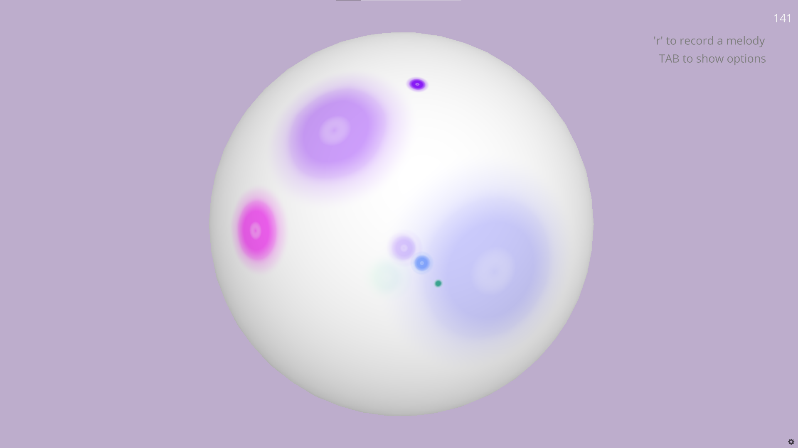
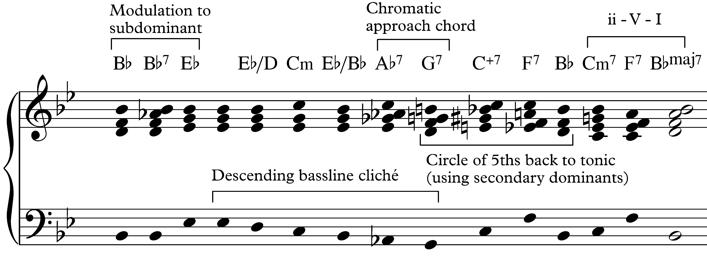

This is the software artefact I submitted for my Masters dissertation, under supervision of Prof. Ian Miguel.

## abstract
> Software is a natural ally to generative music. Several existing software systems have
created interactive, ambient musical experiences, featuring static scale-based harmony.
In the neighbouring field of music information retrieval, analysts have used linguistically
inspired approaches to model harmonic structure.
In this project, I present the implementation and evaluation of an interactive, harmony-driven, generative music system. The system was well received by an initial survey of
users. This work has many potential applications: in music therapy, as an interactive
audio-visual installation, or simply as a source of endless, relaxing background music.

## in fewer words
I wrote some Python code that makes music endlessly in real-time, and renders it along with a visual representation of the sounds.

## design
Here is an overview of the project's design and structure.

### chord generation
The system uses a trigrams model trained on a few thousand jazz tunes, in the form of textual chord charts. The model is then sampled using the previous two chords to inform the choice of the next.

### chord voicing
We can then voice the generated chord symbols as a set of musical pitches, being careful not to create two many dissonances. This is achieved by using a backtracking constraint solver, which searches combinations of pitches until no harmonic rules are violated. As we can see below, the program does a decent job of sticking to idiomatic harmony and voicing!

### creating music from chords
#### melodies
Melodies in this system come in the form of melodic cells. The melodic cells are produced by rhythmic sampling from Perlin noise. Perlin noise is continuous, which helps keep angular melodic shapes to a minimum, and brings a more scalic nature to the music. The Perlin noise is overlaid onto a musical scale to match the current chord.

The melodic cells are evolved gradually over time, using retrograde, inversion, and modular multiplication.

#### basslines
The system either plays one bass note per chord, or walks a bassline by outlining the chord with approach tones.

#### arpeggiator
The chords are also outlined by an arpeggiator, the volume of which is modulated by a low frequency sine wave.

### rendering the sounds
I used [CSound](https://csound.com/) to render audio in real-time. CSound is an audio engine, with its own DSL, which allows you to create your own synthesisers using code. It's really cool, if a little tricky to use. Csound ships with Python bindings, which allow instruments to be controlled via function calls, by sending MIDI style events. You can also vary input parameters to the instruments during playback via channels. As an example, we can vary the timbre of the synth pad periodically (from the Python code) by sending filter thresholds over the channel.

### rendering visuals
I'm using [Ursina](https://www.ursinaengine.org/) to render the visuals. This is a game engine build on top of Panda3D, which means a lot of the hard rendering and UI work is done for us. I settled early on for a design where notes are represented using colours spreading as ripples over a spherical surface. This is achieved by a custom GLSL shader.

The colours map directly to notes, so each chord gets its own colour palette. I've used a system which Stephen Malinowski calls [harmonic colouring](https://www.musanim.com/HarmonicColoring/), so that notes which are harmonically near to each other are similar in colour.

### user interactivity
Users have control of high level controls such as the metre, tempo, and textures. They can also click on the screen to create their own melodies, which are snapped to notes of the current musical scale. Users are able to record a melodic cell of their own, which will subsequently appear in the system generated melodies.

