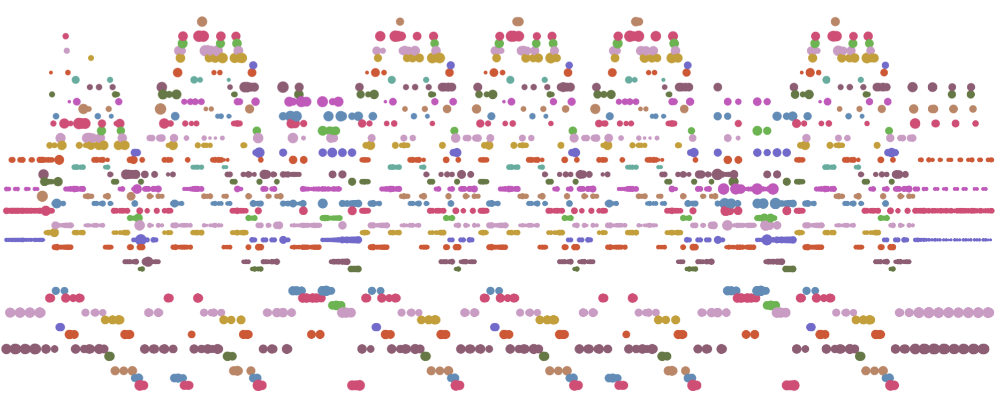
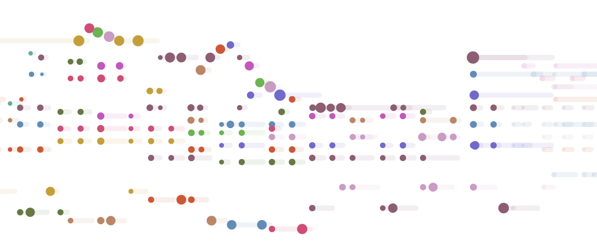
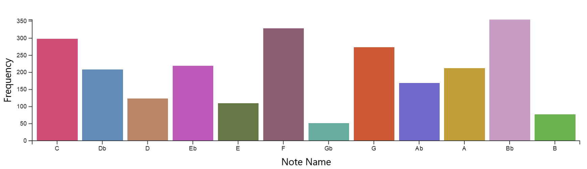
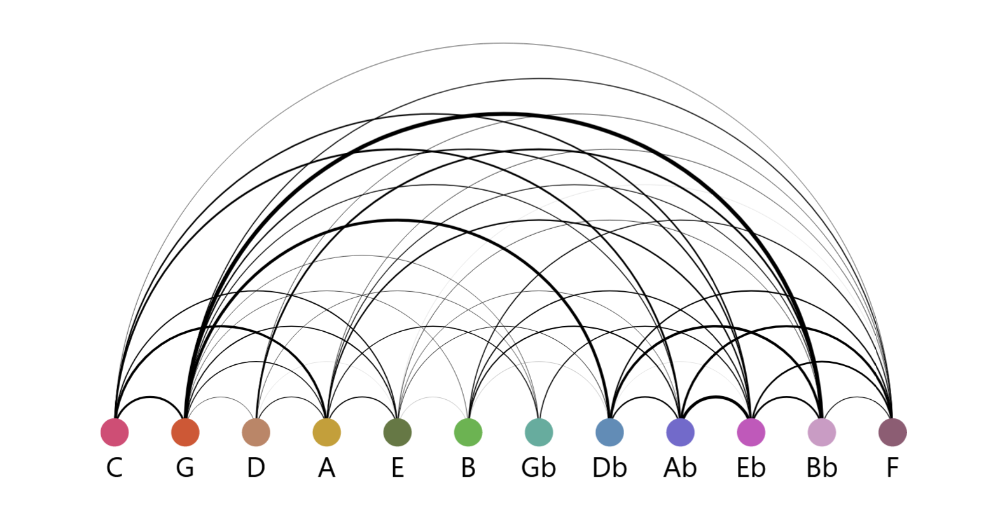
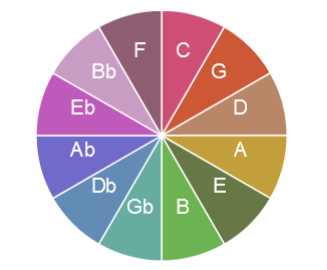

As part of a module on information visualisation, we were given the task of working in pairs to visualise a dataset of our choice. I managed to convince my partner that it would be really cool if our dataset could be music.

Together, we built a system which performs MIDI files in real-time, gradually building up various charts which show info on:
1. how often notes appear and
2. which notes they tend to appear with.

Finally, we plot the notes in the pitch-time space, with louder notes using markers of larger radius. Colour denotes the pitch-class of each note.

## visualisations
We realised our visualisations using [D3.js](https://d3js.org/) on a React website. These two libraries don't play nicely together so we were careful to keep their concerns *very* separate.
### real-time midi plot
This is a straightforward mapping of the musical data onto a two dimensional space. Pitch is displayed on the y axis, and time is displayed on the x axis. Notes are then shown as circular marks in this pitch-time space. The colour of the mark corresponds to the note's pitch class, while the size refers to its volume. When the music is playing, the visualisation zooms in, and the length of the notes is shown as a straight line from the start point to the release point.

### bar chart
This diagram shows total number of occurences of each pitch class in the track.

### arc diagram
This diagram shows the relative frequencies of simultaneously played notes. For the purposes of this explanation, note refers to pitch class. The thickness of each arc corresponds to the number of times this pair of notes has occured, in relation to every other pair of notes. For example, if a pair of notes had sounded exactly once, there would be a single arc with maximum thickness. If a different pair of notes also sounded exactly once, then each arc would be half the thickness. As this diagram only considers pitch class rather than absolute pitch, unisons are not included.

## colour

The visualisations all utitise a mapping from pitch class to colour. This mapping is displayed as a colour wheel on the left of the screen. We are using a perceptually equidistant colour palette, generated using [iwanthue](https://medialab.github.io/iwanthue/). This works better than a simple rainbow scale because human colour perception is not uniform across the spectrum. This is then arranged according to the circle of fifths, so that notes which are harmonically more similar are also closer together in the colour space. This [harmonic colouring](https://www.musanim.com/HarmonicColoring/) approach was outlined by Stephen Malinowski.

## synthesis
We used the [tone.js](https://tonejs.github.io/) \[[npm](https://www.npmjs.com/package/tone)\] library as our software synth. Given more time, we'd have liked to explore the use of different soundfonts for each instrument in the track (rather than just the default synth sound) to give a more realistic performance.

We used [MidiPlayerJS](https://github.com/grimmdude/MidiPlayerJS#readme) \[[npm](https://www.npmjs.com/package/midi-player-js)\] to parse MIDI data and drive the playback.

