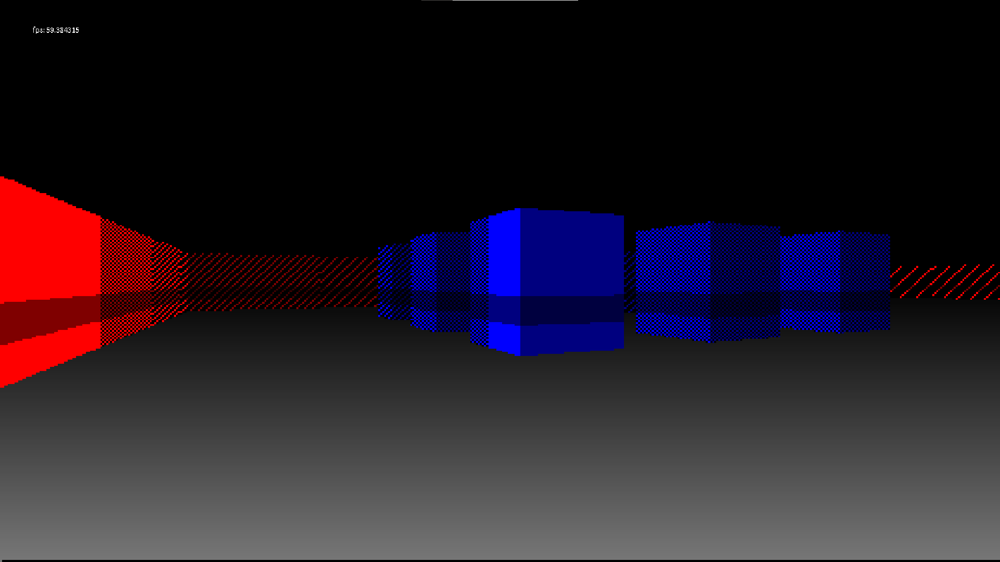
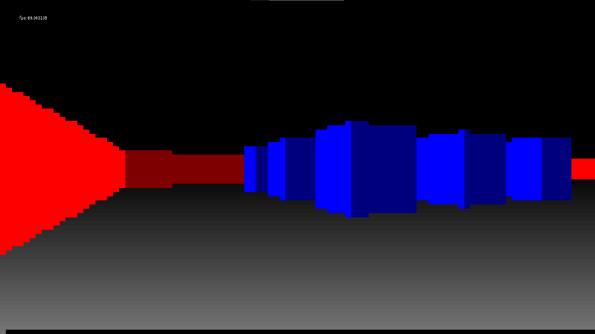
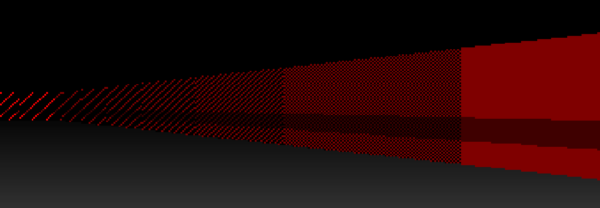

This is a little renderer I wrote in Kotlin (using Processing) for a raycaster game. This project was inspired by a friend of mine who created a terrifying retro horror game for a module we took together a few years back. I'm not sure that my version will ever become a fully-fledged game with an actual gameplay loop and fun mechanics, but if it does I think it'll be a ten-pin bowling game rather than a scare-you-senseless game.

# Raycasting

Raycasting is a rendering technique that was used in some of the first "3D" games, most famously Wolfenstein 3D and DOOM. Raycasting is a cheap technique, which made it ideal back in the early '90s when hardware limitations meant that using a full 3D renderer wasn't an option. I use inverted commas around "3D", because a raycasted world is in fact 2D, projected to appear as if it were 3D. This means that the map is represented as a 2D matrix, rather than a list of models and their positions in 3D space.

## The idea
For each x-coordinate on the screen, we can cast a ray straight out of the camera plane, towards the world. We compute the distance that the ray travels before colliding with the world. This distance determines the height of the vertical line that will be drawn to represent the world at that point.

The code for this is a little fiddly, and [lodev.org](https://lodev.org/cgtutor/raycasting.html) (an amazing resource if you're interested in computer graphics) does an excellent job of explaining the maths behind it.

> Put simply, if the thing is far away, draw a little line; if the thing is close, draw a big line.

Here's a sample at a low resolution which should demonstrate:



I always find it impressive how even at such a low resolution you still get the feel of three-dimensional objects even with very basic two-tone shading. Add in a camera which can move about and the experience is already surprisingly immersive.

# Dithering

Dithering is an old-school technique which uses textured colour to affect perceived brightness. This allows us to improve our shading while still using a reduced colour palette.

The idea here is that if a surface is further away, it should look darker, so we'll add some space between the coloured pixels.



I'm using diagonal lines in my renderer to achieve this just for simplicity, but there are a whole host of dithering algorithms each with different effects.

```
// diagonal stripes
if (normDist.toInt() == 0 || (it + x) % normDist.toInt() == 0) {
    // paint colour
    pixels[it * W_PIXELS + x] = col
} else {
    // else black
    pixels[it * W_PIXELS + x] = app.color(0f)
}
```


